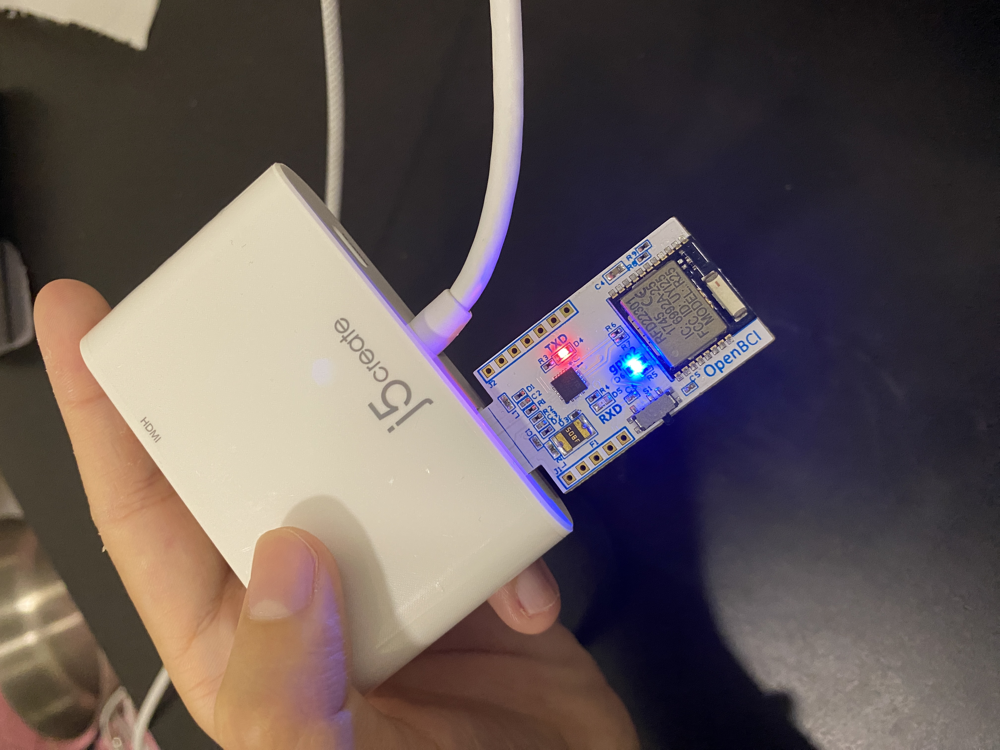
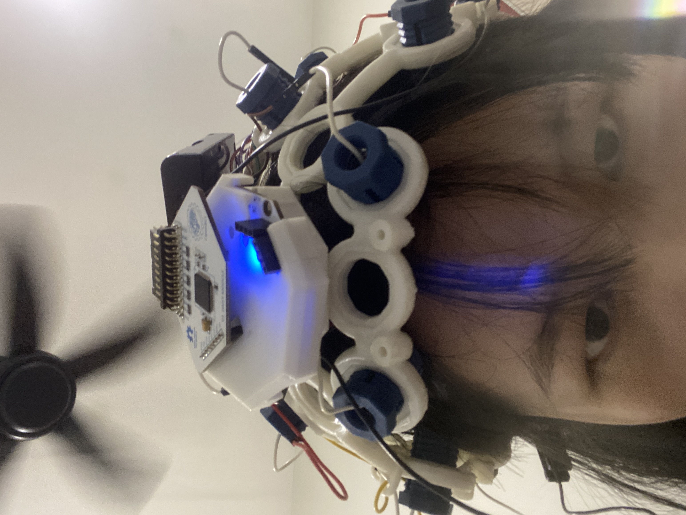
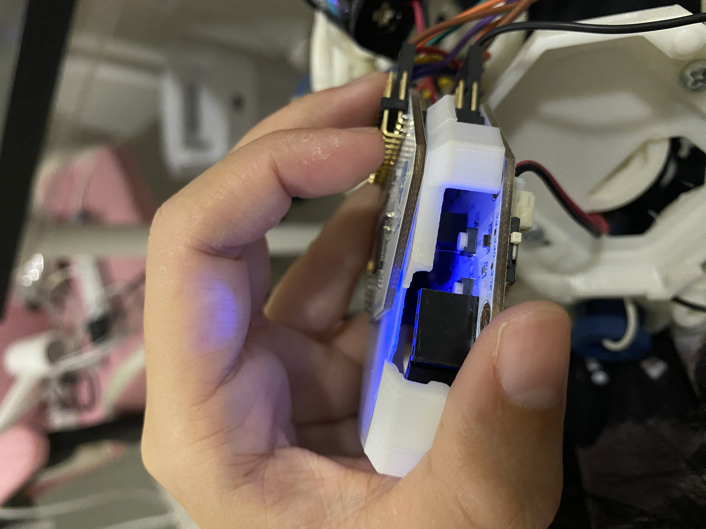

# OpenBCI Hardware Setup Instructions

Step-by-step guide for connecting and operating the OpenBCI Cyton board for EEG data streaming.

## 📋 Prerequisites

- OpenBCI Ultracortex Mark IV headset
- OpenBCI Cyton board (8 channels)
- USB Serial adapter (for MacBook users)
- Computer with USB port
- Python 3.9+ and Node.js 14+ installed

## 🔌 Step 1: Connect USB Serial Adapter

### For MacBook Users
Since MacBooks don't have traditional USB-A ports, you'll need an adapter.



**What to expect:**
- Plug the USB serial adapter into your MacBook
- The **BLUE light** should turn ON immediately
- This indicates power is connected but NOT streaming yet
- Note: At this stage, you'll only see a blue light (no red light)

## 🧠 Step 2: Check Cyton Board on Headset

The Cyton board is attached to the headset you'll be wearing.



**Important checks:**
- The Cyton board should show a **BLUE light** when powered
- This blue light should remain ON while wearing the headset
- If no blue light: check battery and connections

## 🎚️ Step 3: Set Board Switch to PC Mode

**CRITICAL STEP**: The board has a tiny white switch that MUST be in the correct position.



**Switch configuration:**
- Locate the small WHITE switch on the side of the Cyton board
- Switch MUST be set to **"PC"** position (not "BT" or "OFF")
- This enables USB serial communication
- Wrong position = no data streaming!

## 💻 Step 4: Start Backend Server

Open a terminal and run the backend server:

```bash
cd eeg-streaming-project
cd backend
python server.py
```

**Expected output:**
```
Connecting to OpenBCI on /dev/cu.usbserial-DM01MV82...
✓ OpenBCI connected (Blue+Red lights should be ON)
============================================================
OpenBCI WebSocket Server Running
============================================================
Hardware Port: /dev/cu.usbserial-DM01MV82
WebSocket URL: ws://localhost:8765
Sampling Rate: ~250Hz
Data Format: 8 channels, ±100μV range
============================================================
```

## 🔴🔵 Step 5: Verify Streaming Lights

Once the backend server starts successfully:

**USB Serial Adapter LEDs:**
- **BLUE light** = Power/Standby
- **BLUE + RED lights** = Active data streaming

If you see both BLUE and RED lights on the USB adapter, data is streaming!

## 🌐 Step 6: Start Frontend

Open a **new terminal** (keep backend running) and start the frontend:

```bash
cd eeg-streaming-project
cd frontend
npm run dev
```

**Expected output:**
```
> frontend@0.1.0 dev
> next dev

- ready started server on 0.0.0.0:3000, url: http://localhost:3000
```

## 🎯 Step 7: Access the Application

Open your browser and navigate to:
- **Main Dashboard**: http://localhost:3000
- **Image Analysis**: http://localhost:3000/image-analysis

You should see:
- Real-time EEG waveforms
- Live data values in μV
- "Connected" status indicator

## ✅ Verification Checklist

Before starting analysis, verify:

| Component | Status | Indicator |
|-----------|--------|-----------|
| USB Adapter | Connected | Blue light ON |
| Cyton Board | Powered | Blue light ON headset |
| PC/BT Switch | PC Mode | Switch to "PC" position |
| Backend Server | Running | Terminal shows "✓ OpenBCI connected" |
| Data Streaming | Active | USB adapter shows BLUE + RED lights |
| Frontend | Running | Browser shows dashboard |
| WebSocket | Connected | Dashboard shows "Connected" status |

## 🚨 Troubleshooting

### Only Blue Light (No Red Light)
- Backend server not running or failed to connect
- Wrong serial port in `backend/server.py`
- Board switch not in "PC" position

### No Lights at All
- USB not connected properly
- Battery dead on Cyton board
- Adapter not compatible

### "Port not found" Error
Find your port:
```bash
# macOS
ls /dev/cu.usbserial-*

# Linux
ls /dev/ttyUSB*

# Windows
# Check Device Manager for COM port
```

Then update `backend/server.py` around line 24 with your port:
```python
self.port = "/dev/cu.usbserial-YOUR_PORT_HERE"
```

### No Data in Browser
1. Check backend terminal for errors
2. Verify WebSocket URL matches (ws://localhost:8765)
3. Check browser console (F12) for connection errors
4. Ensure both backend and frontend are running

## 📝 Quick Command Reference

```bash
# Terminal 1 - Backend
cd eeg-streaming-project/backend
python server.py

# Terminal 2 - Frontend (new terminal)
cd eeg-streaming-project/frontend
npm run dev

# Terminal 3 - CLI Streamer (optional, for debugging)
cd eeg-streaming-project/backend
python cli_streamer.py

# To stop servers
Ctrl+C in each terminal
```

## 🎮 Operating Tips

1. **Electrode Contact**: Ensure all electrodes have good skin contact (wet with saline if needed)
2. **Minimize Movement**: Reduce artifacts by staying still during capture
3. **Blink/Jaw Artifacts**: These show as spikes - normal but avoid during analysis
4. **Baseline Recording**: Let system run for 30 seconds before analysis to stabilize

## 📊 LED Status Summary

| Device | Blue Only | Blue + Red | No Light |
|--------|-----------|------------|----------|
| USB Adapter | Standby/Ready | Streaming Data | Not Connected |
| Cyton Board | Powered On | N/A | No Power/Battery |

## 🔄 Startup Sequence

1. Connect hardware → Blue light
2. Set switch to PC → Still blue
3. Run backend → Blue + Red lights
4. Run frontend → Access in browser
5. Start analysis → Real-time EEG data!

## ⚡ Quick Start (After Initial Setup)

```bash
# Once everything is configured, just run:
cd eeg-streaming-project
python backend/server.py  # Terminal 1
npm run dev --prefix frontend  # Terminal 2
```

---

**Remember**: The transition from BLUE only to BLUE+RED lights confirms data is streaming. No red light = no data!

For additional help, check the main README.md or the troubleshooting section.